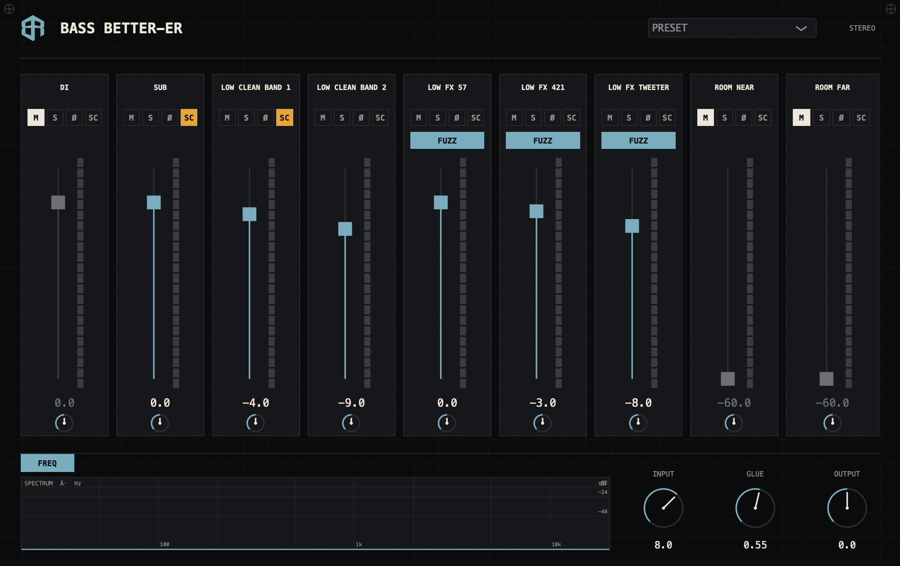

# Bass Better-er

**[⬇️ Download the latest release here](https://github.com/boxofrules/bass-betterer/releases/latest)** — pick the file for your platform (macOS / Windows / Linux), then follow the [install steps](#install-from-a-release) below. **macOS users:** the first open gets blocked by a security warning — that's expected (not notarized), see [how to get past it](#install-from-a-release).

One bass DI, rebuilt into a whole session.

A JUCE 8 audio effect plugin (AU and VST3, macOS and Windows). Drop it on a bass DI and it splits the signal into parallel layers. Each layer owns its slice of the spectrum and is voiced from a real Box of Rules studio capture, then they blend back into one apparent instrument. Deeper, wider, and more alive than the DI that went in.

Influenced heavily by the bass tones of Royal Blood, Justin Chancellor of Tool, and Muse. Big, harmonically rich low end that sits larger than the mix. The intent is simple: a low effort, low complexity way to get a studio ready signal from any bass input. No amp, no mic setup, no routing. Drop it on a DI and go.

## Channels and controls

A real bass record is never one signal. It is a foundation you feel, a body you hear, dirt that bites, and the room around all of it, balanced live. **Bass Better-er** bottles that as parallel frequency role layers. They overlap rather than brick wall, the lows stay mono and centred, and the stereo image widens as it climbs. It holds together on a phone and opens up on a big system.

| Layer | Role |
| --- | --- |
| DI | The original dry DI tone, blended back in. Muted by default. Carries the A/B button. |
| SUB | The foundation. Always on, dead centre. |
| LOW CLEAN | Body and warmth. |
| LOW FX | Grit and aggression, with an engageable FUZZ. |
| ROOM | Air and space around the whole thing. |

Every layer is a channel strip with the same controls.

| Strip control | What it does |
| --- | --- |
| Gain | Layer level. |
| M | Mute. |
| S | Solo. |
| Pan | Placement in the stereo field (shown only in stereo; SUB and DI have none — they stay dead centre). |
| Ø | Phase (polarity) invert. |
| SC | Sidechain. Duck this layer when the dirt hits, keyed off the LOW FX. |
| FUZZ | Engage the dirt. LOW FX layers only. |

**Sidechain ducking:** the LOW FX dirt acts as a sidechain key. Arm SC on any layer, even the SUB, and it ducks out of the way when the dirt comes in, so the grit cuts through without the low end fighting it.

| Master | What it does |
| --- | --- |
| INPUT | Input gain. Also drives the fuzz, like a pedal. |
| GLUE | Sums the layers into one cohesive instrument. |
| OUTPUT | Output gain. |
| FREQ | Spectrum display — click to cycle OFF / ALL / PRE (DI only) / POST (plugin only). OFF saves CPU. |
| A/B | On the DI strip: audition the raw DI against the processed sound (click-free, never saved with the session). |
| SYS | Live engine stats: CPU load, latency, sample rate, buffer size, host, OS — with one-click COPY for bug reports. |

In ALL view the spectrum draws two curves: the raw **DI** in grey and the processed **OUT** in cyan, so you can see exactly what the stack is adding.

**Presets:** the header PRESET menu has factory starting points (Hysterical, Subby, Clean Stack, Dirt Duck, Init) plus a Save current option for your own. Saved presets are portable across projects. Your full settings are also saved with the DAW project automatically, and via the host's own preset and A/B system.

## How it works (tech FAQ)

The honest engineering answers, for those who asked.

**Signal flow.** `DI → INPUT gain → parallel layers (each: [optional fuzz stage] → convolution with a measured studio impulse response) → per-strip gain / pan / phase / duck → stereo sum → GLUE → OUTPUT gain`. The ROOM layers are fed the blended sum of the voicing layers rather than the raw DI, the way a room hears a rig. The DI strip taps the input before INPUT gain, so it stays truly dry.

**What is each layer, really?** A measured impulse response of a real studio capture chain (instrument, amplification, transducer, and desk), one per frequency role, convolved in real time. The capture chain itself is the proprietary part and stays undisclosed.

**Is there aliasing in the fuzz?** The fuzz drive stage runs 4× oversampled (polyphase IIR half-band filters) around the waveshaper, so the harmonics it generates fold back far above the audible band. The oversampler adds only sub-sample group delay inside that path.

**What exactly is GLUE?** One soft stereo bus compressor on the summed mix — not a chain of them. The knob sweeps threshold from −3 to −24 dB and ratio from 1:1 to 6:1 (12 ms attack, 160 ms release) with gentle automatic make-up. Everything you hear, including the DI strip, passes through it.

**Is the fuzz louder than clean?** Not any more. As of v0.1.4 the fuzz path is loudness-matched (K-weighted) to the clean voicing on each LOW FX strip, so toggling FUZZ changes character, not volume. Old saved sessions are migrated automatically so existing mixes don't shift.

**Latency?** Zero samples reported to the host, and genuinely zero-latency convolution (no lookahead, no FFT block delay on the direct path). Check SYS for the live numbers.

**Mono or stereo?** Automatic from the track. On a mono track the pan controls hide and the stack renders mono; in stereo the lows stay centred and the image widens as the frequency climbs.

**CPU?** Low. On an Apple Silicon core at 48 kHz / 512-sample blocks the worst case (all three fuzzes, rooms, and the spectrum display engaged) measures around 1–2 % of one core; an all-clean setting is under 1 %. The SYS panel shows the live figure in your own host, and the repo carries the benchmark harness (`tools/`) the numbers come from.

**Does it phone home?** The editor asks the public GitHub releases feed — at most once a day — whether a newer version exists, and shows an UPDATE notice if so. Nothing about you, your audio, or your session is sent; it is the same request your browser makes opening the releases page. No other network access of any kind.

## Glossary

| Term | Meaning |
| --- | --- |
| DI | Direct Input — the clean, dry signal straight from your bass (via an audio interface or DI box), before any amp or effect. This plugin's whole job is turning that into a finished sound. |
| IR / convolution | An impulse response is a sonic fingerprint of a real signal chain. Convolution applies that fingerprint to your signal in real time, so it takes on the captured character. |
| Fuzz | Heavy, saturated distortion — the aggressive layer of the sound. Here it lives on the LOW FX strips only, leaving the foundation clean underneath. |
| Glue | Gentle compression applied to the summed mix so the parallel layers move together and read as one instrument. |
| Sidechain duck (SC) | One signal automatically lowering another. Arm SC on a layer and it dips out of the way whenever the LOW FX dirt hits, then comes back. |
| Phase invert (Ø) | Flips a layer's waveform upside down. If two layers cancel each other and sound thin, flipping one often locks them back in. |
| Mono fold-down | How the sound survives on a single speaker (phones, club PA subs). The lows here are mono by design, so it does. |
| A/B | Quick comparison between two states — here, the untouched DI versus the full processed stack. |

## Install (from a Release)

Grab the [latest Release](https://github.com/boxofrules/bass-betterer/releases/latest) installer for your platform.

**macOS:** open `Bass-Better-er-macOS.dmg` and run the installer (`.pkg`) — universal Apple Silicon and Intel. It installs to the system plug-in folders:

| Format | Installed to |
| --- | --- |
| AU | `/Library/Audio/Plug-Ins/Components/Bass Better-er.component` |
| VST3 | `/Library/Audio/Plug-Ins/VST3/Bass Better-er.vst3` |

The macOS build is Developer ID signed and notarized by Apple, so the installer opens and runs without any Gatekeeper prompt.

**Windows:** run `Bass-Better-er-Windows.exe`. Windows is VST3 only (there is no AU), installed to the standard shared VST3 folder:

| Format | Installed to |
| --- | --- |
| VST3 | `C:\Program Files\Common Files\VST3\Bass Better-er.vst3` |

**Linux:** grab `Bass-Better-er-Linux-VST3.zip`, unzip it, and copy the `Bass Better-er.vst3` folder into one of these (Linux is VST3 only, no AU; native x86_64, for hosts like Ubuntu Studio / Reaper / Ardour):

| Scope | Copy `Bass Better-er.vst3` to |
| --- | --- |
| Just you | `~/.vst3/` |
| All users | `/usr/lib/vst3/` |

Restart your DAW, rescan plug-ins, then drop it on a bass DI track.

## Support

Made by Box of Rules. **Bass Better-er** was not cheap or quick to build. It is years in the making, drawing on 15 years of professional engineering experience ([deviantops.com](https://deviantops.com)) and a lot of studio time capturing and tuning the real signal chain behind it.

It is free to use. If it earns a place on your tracks, throw a coffee in the tip jar. It funds more free tools like this.

[☕ ko-fi.com/boxofrules](https://ko-fi.com/boxofrules)

## Disclaimer

**Bass Better-er** is provided "as is", with no warranty of any kind. To the maximum extent permitted by law, Box of Rules accepts no responsibility or liability for any damage, data loss, crashes, or other issues arising from this software or from its installation. You install and use it entirely at your own risk.

## License

Proprietary. © Box of Rules. All rights reserved. See [LICENSE](LICENSE).
