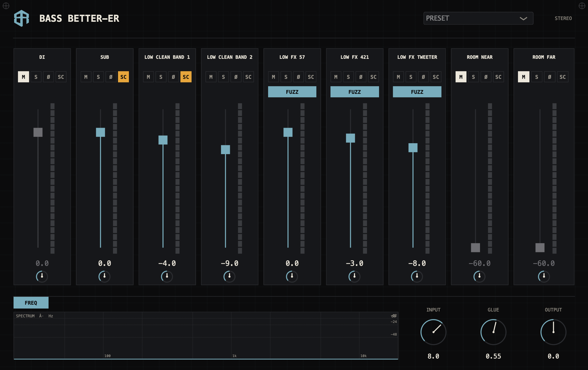

# Bass Better-er

[](https://github.com/boxofrules/bass-betterer/releases/latest)
[](https://ko-fi.com/boxofrules)

**[⬇️ Download the latest release here](https://github.com/boxofrules/bass-betterer/releases/latest)** — pick the file for your platform (macOS / Windows / Linux), then follow the [install steps](#install-from-a-release) below. The macOS build is signed + notarized, so it just opens; Windows is unsigned, so SmartScreen may warn (**More info → Run anyway**).

One bass DI, rebuilt into a whole session.

A JUCE 8 audio effect plugin (AU, VST3, and Standalone, macOS and Windows). Drop it on a bass DI and it splits the signal into parallel layers. Each layer owns its slice of the spectrum and is voiced from a real Box of Rules studio capture, then they blend back into one apparent instrument. Deeper, wider, and more alive than the DI that went in.



Influenced heavily by the bass tones of Royal Blood, Justin Chancellor of Tool, and Muse. Big, harmonically rich low end that sits larger than the mix. The intent is simple: a low effort, low complexity way to get a studio ready signal from any bass input. No amp, no mic setup, no routing. Drop it on a DI and go.

## What's new in 1.0

Out of beta.

- **GUITAR MODE** — the new GUITAR MODE key (top bar) pitches your input down a full octave *before* the whole tone stack: plug in a guitar, get a bass. The entire UI turns red so you always know which world you're in. Single notes and power chords track tight; complex chords warble a little, exactly like a hardware octaver. Engaging it adds ~32 ms of octave-tracking latency (reported to your DAW, which compensates on playback); switch it off and the plugin is zero-latency again. Presets don't touch it — it's "what's plugged in", not a tone. Plugin formats only (AU/VST3/AAX): the Standalone app doesn't carry the GUITAR MODE key.
- **DRIVE, RELEASE and SUSTAIN dials** — the drive stage, opened up. DRIVE scales how hard every drive strip hits its clipper (100 % is the classic amount, exactly). The fuzz used to hug your note's decay so tightly it could read as a sidechain-style duck after each pluck; the new RELEASE dial (default 2.5 s, tuned by ear on real stems) lets the drive hang on and bloom instead. SUSTAIN adds upward compression inside the drive for even more hold. The trio lives left of INPUT and lights up when any drive is engaged. Old sessions keep their exact old sound automatically.
- **Room FEED selects** — each ROOM strip now has a column of six keys choosing which layers feed that room (SUB · 15" · 12" · 57 · 421 · TW). Rooms too boomy? Drop SUB out of them. All-on is the classic feed, so existing sessions are untouched.
- **Master EQ** — a four-dial EQ column (LOW / LO MID / HI MID / HIGH, ±12 dB) after GLUE for final shaping without leaving the plugin. Click a band's label to choose its frequency. At zero it is truly out of the circuit.
- **Cleaner strip names** — the legacy "LOW" prefix is gone: the clean bands are now CLEAN 15" and CLEAN 12" (named for the speakers they lean on) and the drive strips are FX 57, FX 421 and FX TWEETER. Names only — sessions, presets and automation are untouched.
- All the v0.2.x features (DIST character, preset file loading, clean init defaults) are unchanged; FUZZ at the stock RELEASE remains byte-for-byte identical to every release before it.

## What's new in 0.2.x

- **A second drive character: DIST** — every drive strip now offers FUZZ (the original, byte-for-byte unchanged) or DIST, a second amp character: the same drive through a blended rig capture. Click the strip's TYPE key to switch; loudness is matched so switching compares character, not volume.
- **New presets** — Dist Stack joins the bank; Dirt Duck is now Dirt Wall.
- **Load preset file** — the PRESET menu can now load a preset file someone sent you, and keeps it in your User list.
- **New init defaults** — a fresh instance (and the Init preset) starts fully clean: FUZZ off on the FX strips, FREQ spectrum set to ALL. Saved sessions and the other factory presets are unaffected.
- **Sidechain ducking removed** — the SC keys are gone; per-strip sidechain ducking (a much deeper version, any strip against any strip or an external input) lives in [Box of Bass](https://boxofrules.com/plugins/box-of-bass/). Old sessions that used SC load fine but no longer duck.
- **AAX (Pro Tools) builds, now signed** — the AAX target builds and is signed with the PACE tools, and loads in retail Pro Tools. Not in the Release downloads yet: the shipped build needs to cover Apple silicon and Intel both, which lands with a future release. See [Building the AAX target](#building-the-aax-target).

## Channels and controls

A real bass record is never one signal. It is a foundation you feel, a body you hear, dirt that bites, and the room around all of it, balanced live. **Bass Better-er** bottles that as parallel frequency role layers. They overlap rather than brick wall, the lows stay mono and centred, and the stereo image widens as it climbs. It holds together on a phone and opens up on a big system.

| Layer | Role |
| --- | --- |
| DI | The original dry DI tone, blended back in. Muted by default. Carries the A/B button. |
| SUB | The foundation. Always on, dead centre. |
| CLEAN 15" / CLEAN 12" | Body and warmth, named for the speakers they lean on. |
| FX 57 / FX 421 / FX TWEETER | Grit and aggression, with an engageable drive (FUZZ or DIST). |
| ROOM NEAR / ROOM FAR | Air and space around the whole thing, each with FEED keys choosing which layers it hears. |

Every layer is a channel strip with the same controls.

| Strip control | What it does |
| --- | --- |
| Gain | Layer level. |
| M | Mute. |
| S | Solo. |
| Pan | Placement in the stereo field (shown only in stereo; SUB and DI have none — they stay dead centre). |
| Ø | Phase (polarity) invert. |
| FUZZ / DIST | Engage the drive; the key reads the active character. Drive-capable layers only. |
| TYPE | Switch the drive character between FUZZ and DIST. |
| FEED (SUB · 15" · 12" · 57 · 421 · TW) | ROOM strips only: choose which layers feed that room. All-on is the classic full-stack feed. |

**Double-click to reset:** double-click any fader, pan, or master knob and it snaps back to its default (pan returns to dead centre).

| Master | What it does |
| --- | --- |
| INPUT | Input gain. Also drives the fuzz, like a pedal. |
| DRIVE | How hard every drive strip hits its clipper, 25–400 % of the classic amount (100 % = the original FUZZ/DIST, exactly). |
| RELEASE | How long the drive's envelope hangs on after each note (all drive strips share it). Short = tight and percussive; long (the default) = blooming sustain. |
| SUSTAIN | Upward compression inside the drive — quieter tails come back louder. 0 is the classic envelope. |
| GLUE | Sums the layers into one cohesive instrument. |
| EQ (LOW / LO MID / HI MID / HIGH) | Four-dial master EQ after GLUE, ±12 dB per band. Click a band's label to choose where its shelf/peak sits (e.g. LO MID at 180, 250, 350 or 500 Hz). At zero gain a band is completely out of the signal path. |
| OUTPUT | Output gain. |
| FREQ | Spectrum display — click to cycle OFF / ALL / PRE (DI only) / POST (plugin only). OFF saves CPU. |
| A/B | On the DI strip: audition the raw DI against the processed sound (click-free, never saved with the session). |
| SYS | Live engine stats: CPU load, latency, sample rate, buffer size, host, OS — with one-click COPY for bug reports. |

In ALL view the spectrum draws two curves: the raw **DI** in grey and the processed **OUT** in cyan, so you can see exactly what the stack is adding.

**Presets:** the header PRESET menu has factory starting points (Hysterical, Subby, Clean Stack, Dirt Wall, Dist Stack, Init) plus a Save current option for your own. Saved presets are portable across projects. Your full settings are also saved with the DAW project automatically, and via the host's own preset and A/B system.

## How it works (tech FAQ)

The honest engineering answers, for those who asked.

**Signal flow.** `DI → INPUT gain → parallel layers (each: [optional fuzz stage] → convolution with a measured studio impulse response) → per-strip gain / pan / phase → stereo sum → GLUE → master EQ → OUTPUT gain`. The ROOM layers are fed a blended sum of the voicing layers rather than the raw DI, the way a room hears a rig — and each room's FEED keys choose which layers are in that blend. The DI strip taps the input before INPUT gain, so it stays truly dry.

**What is each layer, really?** A measured impulse response of a real studio capture chain (instrument, amplification, transducer, and desk), one per frequency role, convolved in real time. The capture chain itself is the proprietary part and stays undisclosed.

**Is there aliasing in the fuzz?** The fuzz drive stage runs 4× oversampled (polyphase IIR half-band filters) around the waveshaper, so the harmonics it generates fold back far above the audible band. The oversampler adds only sub-sample group delay inside that path.

**What exactly is GLUE?** One soft stereo bus compressor on the summed mix — not a chain of them. The knob sweeps threshold from −3 to −24 dB and ratio from 1:1 to 6:1 (12 ms attack, 160 ms release) with gentle automatic make-up. Everything you hear, including the DI strip, passes through it.

**Is the fuzz louder than clean?** Not any more. As of v0.1.4 the fuzz path is loudness-matched (K-weighted) to the clean voicing on each FX strip, so toggling FUZZ changes character, not volume. Old saved sessions are migrated automatically so existing mixes don't shift.

**Can I MIDI-map the controls?** Yes. Every fader, dial and key is a host-automatable plugin parameter, so anything your DAW can learn, it can map — in Logic via Smart Controls / controller assignments (learn mode), and the same idea in Live, Cubase, Reaper and friends. Nothing to configure on the plugin side.

**Latency?** Zero samples reported to the host, and genuinely zero-latency convolution (no lookahead, no FFT block delay on the direct path). Check SYS for the live numbers.

**Mono or stereo?** Automatic from the track. On a mono track the pan controls hide and the stack renders mono; in stereo the lows stay centred and the image widens as the frequency climbs.

**CPU?** Low. On an Apple Silicon core at 48 kHz / 512-sample blocks the worst case (all three fuzzes, rooms, and the spectrum display engaged) measures around 1–2 % of one core; an all-clean setting is under 1 %. The SYS panel shows the live figure in your own host, and the repo carries the benchmark harness (`tools/`) the numbers come from.

**Does it phone home?** The editor asks the public GitHub releases feed — at most once a day — whether a newer version exists, and shows an UPDATE notice if so. Nothing about you, your audio, or your session is sent; it is the same request your browser makes opening the releases page. No other network access of any kind.

## Glossary

| Term | Meaning |
| --- | --- |
| DI | Direct Input — the clean, dry signal straight from your bass (via an audio interface or DI box), before any amp or effect. This plugin's whole job is turning that into a finished sound. |
| IR / convolution | An impulse response is a sonic fingerprint of a real signal chain. Convolution applies that fingerprint to your signal in real time, so it takes on the captured character. |
| Fuzz | Heavy, saturated distortion — the aggressive layer of the sound. Here it lives on the FX strips only, leaving the foundation clean underneath. |
| Glue | Gentle compression applied to the summed mix so the parallel layers move together and read as one instrument. |
| Phase invert (Ø) | Flips a layer's waveform upside down. If two layers cancel each other and sound thin, flipping one often locks them back in. |
| Mono fold-down | How the sound survives on a single speaker (phones, club PA subs). The lows here are mono by design, so it does. |
| A/B | Quick comparison between two states — here, the untouched DI versus the full processed stack. |

## Install (from a Release)

Grab the [latest Release](https://github.com/boxofrules/bass-betterer/releases/latest) installer for your platform.

**macOS:** open `Bass-Better-er-macOS.dmg` and run the installer (`.pkg`) — universal Apple Silicon and Intel. It installs to the system plug-in folders:

| Format | Installed to |
| --- | --- |
| AU | `/Library/Audio/Plug-Ins/Components/Bass Better-er.component` |
| VST3 | `/Library/Audio/Plug-Ins/VST3/Bass Better-er.vst3` |

The macOS build is Developer ID signed and notarized by Apple, so the installer opens and runs without any Gatekeeper prompt.

**Windows:** run `Bass-Better-er-Windows.exe`. Windows is VST3 only (there is no AU), installed to the standard shared VST3 folder:

| Format | Installed to |
| --- | --- |
| VST3 | `C:\Program Files\Common Files\VST3\Bass Better-er.vst3` |

**Linux:** grab `Bass-Better-er-Linux-VST3.zip`, unzip it, and copy the `Bass Better-er.vst3` folder into one of these (Linux is VST3 only, no AU; native x86_64, for hosts like Ubuntu Studio / Reaper / Ardour):

| Scope | Copy `Bass Better-er.vst3` to |
| --- | --- |
| Just you | `~/.vst3/` |
| All users | `/usr/lib/vst3/` |

Restart your DAW, rescan plug-ins, then drop it on a bass DI track.

**Standalone app (no DAW needed):** each Release also has `Bass-Better-er-{macOS,Windows,Linux}-Standalone.zip`. The standalone is **not installed anywhere** — unzip it wherever you like and run the app directly (`Bass Better-er.app` / `.exe` / the `Bass Better-er` binary). It picks an audio input/output device and runs the same tone stack without a host. The macOS app is signed + notarized, so it opens with no Gatekeeper prompt; the Windows app is unsigned, so SmartScreen may warn — **More info → Run anyway**.

## Building the AAX target

**Not in the Release downloads yet.** The AAX target builds, and release builds are signed with the PACE code-signing tools, which retail Pro Tools requires and accepts. What is missing is release plumbing: a universal (Apple silicon + Intel) build wired into CI. Until that lands, the downloads carry AU/VST3/Standalone only.

Bass Better-er can optionally build an AAX format alongside AU/VST3/Standalone if you point the build at a local checkout of the (free) Avid AAX SDK:

```sh
cmake -B build-aax -DCMAKE_BUILD_TYPE=Release -DBOR_NATIVE_ONLY=ON \
    -DBOR_AAX_SDK_PATH=/path/to/aax-sdk
cmake --build build-aax --target BoRBassEnhancer_AAX -j
```

Leave `BOR_AAX_SDK_PATH` unset (the default) and the build is identical to before — AU/VST3/Standalone only, exactly like CI. Setting it to a valid SDK path adds `AAX` to the build's formats; JUCE builds the AAX wrapper itself from that SDK, no extra plugin code needed.

**Signing.** Avid requires AAX plugins to be signed with the PACE code-signing tools before retail Pro Tools will load them; an unsigned local build loads only in a Pro Tools Developer build. Release builds are signed as part of the release process (the signing tools and certificate are not in this repo).

## Support

Made by Box of Rules. **Bass Better-er** was not cheap or quick to build. It is years in the making, drawing on 15 years of professional engineering experience ([deviantops.com](https://deviantops.com)) and a lot of studio time capturing and tuning the real signal chain behind it.

It is free to use. If it earns a place on your tracks, throw a coffee in the tip jar. It funds more free tools like this.

[☕ ko-fi.com/boxofrules](https://ko-fi.com/boxofrules)

## Disclaimer

**Bass Better-er** is provided "as is", with no warranty of any kind. To the maximum extent permitted by law, Box of Rules accepts no responsibility or liability for any damage, data loss, crashes, or other issues arising from this software or from its installation. You install and use it entirely at your own risk.

## License

Source-available, not open source. © 2026 Box of Rules. See [LICENSE](LICENSE) for the full terms.

- The **released binaries** are free to download and use, including on commercial productions.
- This **repository is public on GitHub**, so — per the [GitHub Terms of Service](https://docs.github.com/en/site-policy/github-terms/github-terms-of-service) — you may view it and fork it on GitHub. No other redistribution or derivative-product rights are granted.
- The **cab impulse responses** are proprietary and are committed only in encrypted form.
- Built with [JUCE 8](https://juce.com), used under the [JUCE 8 EULA](https://juce.com/legal/juce-8-licence/) (commercial licence, Starter tier), not the AGPLv3. JUCE is not included in this repository; it is fetched at build time.
